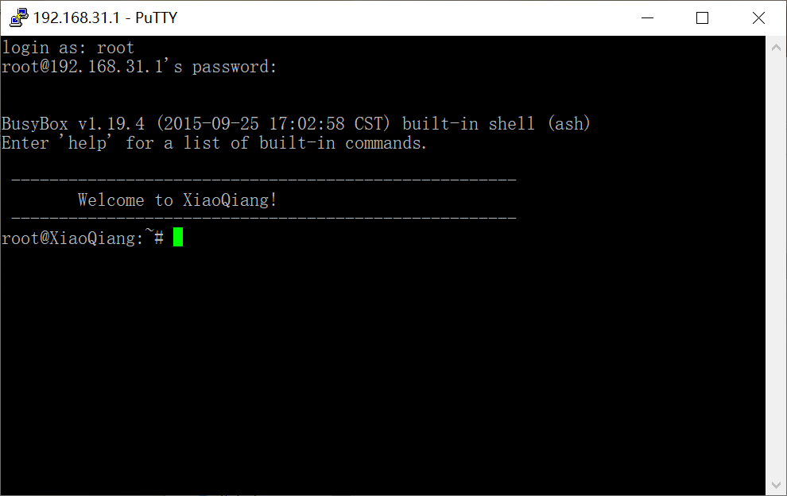

# 该项目已完工！

# NJUPT_NET_2018：通过该教程实现路由器使用单个账号免登陆共享校园网！

# 注意：目前该方案仅适用于学科楼。

# 我校使用的Drcom版本是D版，理论上相同版本的学校也可以使用该教程。

我邮的校园网有2种接入方式，第1种是有线接入(网线)，第2种是无线接入(NJUPT)。这里主要讨论第1种有线接入的情况。

一般情况下，有线接入后通过Web方式(3a.njupt.edu.cn)或者使用Drcom客户端(D版)进行认证。校园网可以使用路由器，将网线接在WAN口，这样一台设备登录后，可以实现一号多设备共享，但是该方法下每次都需要重新登录，打开认证网页再输入账号和密码十分麻烦。通过本教程可以实现路由器通电自动认证校园网。

# 第一部分：前期准备工作--路由器刷入第三方固件

首先需要准备一个支持刷入第三方固件的路由器，是否支持主要查看CPU型号、内存以及运存，这里不再科普。

支持路由器列表：小米路由器青春版(推荐)、小米路由器MiNi版、极路由1S等等。

本人使用的是小米路由器青春版，不是MiNi版，CPU是MTK7628、内存16M、运存64M。

## 第1步：开启SSH功能
部分路由器默认未开启SSH功能，比如小米路由，极路由默认没有SSH功能，因此需要自己手动开启该功能。

关于这部分暂时略过，可以自行检索相关教程。

## 第2步：备份原厂固件，刷入breed
需要工具：Putty、WinSCP。这里以我的小米路由青春版为例。

### 1）使用putty连接路由器后台

登录putty，主机名：192.168.31.1，端口：22，连接类型：SSH

注意：用户名root，输入管理员密码，注意Linux下密码不显示已输入字符。

### 2）查看原厂固件

输入：cat /proc/mtd

可以看到有十个固件和分区，第一个mtd0固件包含已全部分区的数据（All），第二个是Bootloader。

### 3）备份原厂固件

输入：dd if=/dev/mtd0 of=/tmp/all.bin

注意：这里备份时间较久请耐心等待，我只备份了all.bin，可以参照自行备份其它分区。

### 4）使用WinSCP连接路由器后台

登录WinSCP，文件协议：SCP；主机名：192.168.31.1；端口号：22，用户名：root，还有密码

### 5）上传breed

进入/tmp目录，将刚才备份的all.bin下载到本地，同时将breed(在ROMS目录中可下载)上传至/tmp目录中

### 6）刷入breed

打开putty，输入：mtd -r write /tmp/breed.bin Bootloader

此时成功刷入breed。

## 第3步：进入Breed，刷入第三方固件

### 1）进入breed界面
首先路由器拔出电源，然后通电后按住复位键5秒松开，浏览器输入192.168.1.1，成功进入breed界面

目前支持自动认证的固件包括：Openwrt、老毛子Padavan、PandoraBox，这里以老毛子Padavan为例。

### 2）刷入第三方固件(在roms目录中下载)

等待路由器自动重启，至此，准备工作已经全部完成。

# 第二部分：抓包获取Drcom登录数据

这部分暂时略过，主要用Wireshark抓包Drcom客户端的数据。

南邮的可以直接下载我的配置文件(在config目录中下载)，修改成自己的账号和密码就行。

# 第三部分：上传配置文件

## 一、老毛子Padavan方案-C语言版(推荐)
### 1）进入路由器管理界面
老毛子Padavan默认WiFi名PDCN，连接密码是1234567890，浏览器输入192.168.123.1，用户名：admin，密码：admin

### 2）开启SSH功能
高级设置->系统管理->服务->启用 Telnet 服务 + 启用 SSH 服务

### 3）上传配置文件
打开WinSCP，上传dogcom和 drcom.conf至/etc/storage/bin，选中这2个文件右键，赋予0777权限

### 4）设置开机自启动

高级设置->自定义设置->脚本->在 WAN 上行/下行启动后执行，在文本框输入命令：

/etc/storage/bin/dogcom -m dhcp -c /etc/storage/bin/drcom.conf -e -d &

### 5）确认保存配置

高级设置->系统管理->控制台，输入：mtd_storage.sh save，点击刷新

### 6）路由器插上网线，重启即可

## 二、Openwrt v17.01版本方案-C语言版(推荐)

### 注意：Openwrt v17.01版就是LEDE

### 1）进入路由器管理界面
浏览器输入192.168.1.1

### 2）开启SSH功能
LEDE默认应该已经开启

### 3）上传配置文件
打开WinSCP，上传dogcom和drcom.conf至/usr目录下，选中这2个文件右键，赋予0777权限

### 4）设置开机自启动
打开WinSCP，打开/etc/rc.local，在exit 0上一行粘贴下面的命令，设置开机自启：

/usr/dogcom -m dhcp -c /usr/drcom.conf -d -e &

### 5）路由器插上网线，重启即可

## 三、Openwrt、PandoraBox方案-Python版(不推荐)

### 1）进入路由器设置页面
浏览器输入192.168.1.1

### 2）开启SSH功能
Openwrt、PandoraBox默认已经开启

### 3）安装python
让路由器联网，使用putty连接路由器，命令行输入以下：

opkg update

opkg install python-light

opkg install python-codecs

opkg install python-openssl

### 4）上传配置文件

打开WinSCP，上传drcom.conf到/etc/，选中这个文件右键，赋予0777权限

上传99-drcom到/etc/hotplug.d/iface/，赋予权限0777

上传drcom到/usr/bin/，赋予权限0777

### 5）设置开机自启动

打开WinSCP，打开/etc/rc.local，在exit 0前加入一行 drcom &

### 6）路由器插上网线，重启即可

# 特别说明

### 1）本项目很多资源来自网上，均是开源项目，本人仅是收集整理，如有意见请联系我删除。

### 2）特别指出禁止任何个人或者公司将其投入商业使用，由此造成的后果和法律责任均与本人无关。
